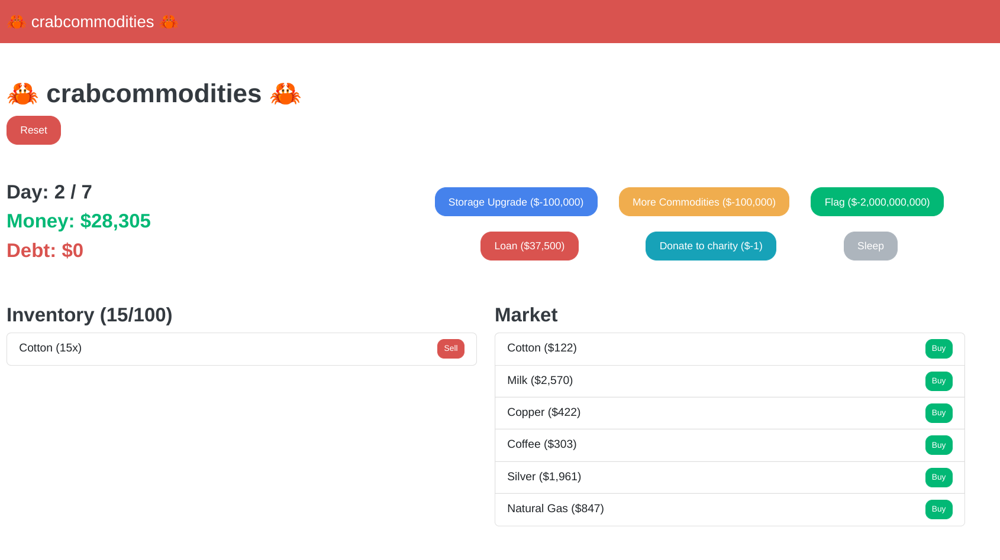

# Writeup

Recently, I've been trying to learn Rust. I think one of the best ways to learn a new programming language is to try and create projects using it, which is why I decided to make another Rust web challenge after receiving good feedback from `web/rustshop` from corCTF 2022.

Crab Commodities was a server-side web challenge written in Rust, where you played a simple commodity trading simulator game. If anyone remembers the old game "Drug Wars", this was a basic clone. You could buy commodities and hold them to sell later, preferably at a time when the price was higher.



You started out with $30,000, and the goal of the challenge was to somehow increase your money to $2,000,000,000 to buy the flag. However, you only had 7 days to do this before the game would end, and you could only buy or sell once a day. Obviously, no amount of playing this game and trading normally would get you the flag.

So, we need to look at the source code and find some sort of infinite money glitch.

There were two bugs in the code:
1. Underflow/Overflow in most arithmetic operations
2. Race conditions literally everywhere

One way to get infinite money is if we can find a way to underflow/overflow something related to our money.

For some context, there were two types of "items" you could buy: market items, like the commodities listed, and upgrades.

Checking out the code, in the route for buying items, we see this code:
```rust
let price = item.price * body.quantity;
if user.game.money.get() < price as i64 {
    return web::Json(APIResult {
        success: false,
        message: "Not enough money for that purchase",
    });
}
```

While we can't control `item.price`, we can control `body.quantity`. The Rust app is built in release mode, so there are actually no integer underflow/overflow checks. If we make `body.quantity` high enough, `item.price * body.quantity` will overflow to a negative number. With a negative price, we would actually gain money from this purchase.

There's only one small problem. There's an if-statement before that checks that our quantity isn't too high:
```rust
if (!user.game.has_upgrade("Storage Upgrade") && body.quantity > Game::BASE_STORAGE)
    || user.game.get_max_storage() < slots_used + body.quantity {
        // fail
    }
```

There are two checks here. It first checks that our quantity isn't above `Game::BASE_STORAGE` if we don't have a "Storage Upgrade". Then it checks that our used amount + the new quantity fits in our max storage.

If the first check wasn't there, we could overflow here as well. We could overflow `slots_used + body.quantity` to be negative, which would allow us to purchase past our max storage. But, we can't get past the first check, since no arithmetic operation happens to `body.quantity`, and we don't start out with a "Storage Upgrade".

So, there are two options left: try to find a way to get a "Storage Upgrade", or try to find another place to underflow/overflow. The intended solution was to try and get a "Storage Upgrade", but I actually missed the overflow check in another vital spot.

Players realized that there was no overflow check when buying upgrades, so you could buy 32767 "Storage Upgrades" and overflow your money. This wasn't intended, I just missed the check here. Once you did this overflow, you would have enough money to overflow with other products instead.

As I mentioned, the intended path was to get a "Storage Upgrade", which costed $100,000, something impossible to get in 7 days. To get this, we'll have to use race conditions.

The important values in this application were stored behind a `LockHelper`, a custom struct which I'll show below:

```rust
// thread-safe lock system
// avoids clones and copies
#[derive(Debug, Clone, Default)]
pub struct LockHelper<T> {
    value: Arc<Mutex<T>>,
}

impl<T: Clone> LockHelper<T> {
    pub fn get(&self) -> T {
        let mutex = self.value.lock().unwrap();
        mutex.clone()
    }
    pub fn set(&self, val: T) {
        let mut mutex = self.value.lock().unwrap();
        *mutex = val;
    }
    pub fn from(val: T) -> LockHelper<T> {
        LockHelper::<T> {
            value: Arc::new(Mutex::new(val)),
        }
    }
}
```

This custom struct allows for values in the User struct to be shared cross threads. You can't just allow different threads to mutably change shared state, since Rust prevents data races. So, a mutex has to be used to ensure that only one thread has access to change the value at a time.

Using a mutex or some other synchronization primitive makes sense to make sure that critical sections don't have race conditions. But, do you notice what's wrong with this code?

The `LockHelper` is used all the time like this:
```rust
user.game.money.set(user.game.money.get() - price as i64);
```

Do you see the problem? It's kind of subtle, but there's actually a huge problem with `LockHelper` and how its used. This code works like this:

1. `user.game.money.get()`: get the money value
    * Lock
    * Read value
    * Unlock
2. `user.game.money.set()`: set the money value based on the previously read value
    * Lock
    * Set value
    * Unlock

This usage is not thread-safe at all! Usually, you would use the mutex to lock over the entire critical section. This would make it so that only one thread could run a critical section at a time, and any other threads would have to wait for the user to finish being updated until they could also get into the critical section.

But, with `LockHelper`, there is basically no race condition protection. Rust prevents data races, not race conditions.

This seems like a perfect time to use the Loan feature! Once per game, we can get a loan of $37,500. To prevent us from getting another loan, it adds our loan to the upgrades list once we've gotten it. Then, when the player asks for a second loan, it checks the list and realizes we have already gotten a loan, and refuses to give us the money.

Since the upgrades list is backed by a `LockHelper`, we have the possibility for a race condition so we can potentially get multiple loans if we get lucky with our timings. Here's the relevant code:
```rust
        // upgrade checks
        if user.game.has_upgrade("Loan") && item.name == "Loan" {
            return web::Json(APIResult {
                success: false,
                message: "You can't take out another loan",
            });
        }
        if user.game.has_upgrade("More Commodities") && item.name == "More Commodities" {
            return web::Json(APIResult {
                success: false,
                message: "You already have access to all commodities",
            });
        }

        if user.game.money.get() < price as i64 {
            return web::Json(APIResult {
                success: false,
                message: "Not enough money",
            });
        }

        let mut upgrades = user.game.upgrades.get();
        upgrades.extend(vec![item].repeat(body.quantity as usize));
        if upgrades.len() > 32767 {
            return web::Json(APIResult {
                success: false,
                message: "Too many upgrades purchased",
            });
        }
        user.game.upgrades.set(upgrades);

        if price != 0 {
            user.game.money.set(user.game.money.get() - price as i64);
        }
```

If we just get past the `user.game.has_upgrade("Loan")` check before the app adds our `"Loan"` item to the list with the line `upgrades.extend(vec![item].repeat(body.quantity as usize));`, we can sneak another loan in.

Easy, right? But, actually, Rust is too 🚀 blazing fast 🚀 to get this race to work. So instead, we have to abuse the upgrade mechanism to make our race delay longer. Here's how the upgrades are checked:

```rust
    pub fn count_upgrades(&self, name: &str) -> i32 {
        self.upgrades.get().iter().filter(|&item| item.name == name).count() as i32
    }

    pub fn has_upgrade(&self, name: &str) -> bool {
        self.count_upgrades(name) > 0
    }
```

So, upgrades are stored in a vector, and then to check whether we have an upgrade, it loops through the entire list. The upgrade vector has a max length of 32767, so...

If we buy many upgrades, there's a chance that looping through the upgrade list will enlarge the race window just enough for us to sneak a couple extra loans in there. Luckily, we can use the donation feature for this! If we donate $5, we will add 5 donation entries to our list, If we donate $30,000, we will add 30,000 donation entries to our list.

It turns out that by donating all our money, and then racing getting a loan, we can get 3 or more loans in one run! Now, we will have more than $100,000, allowing us to get the storage upgrade, and then underflowing the price to give ourselves infinite money.

Doing this, and then buying the "Flag" upgrade, we solve the challenge!

> **SEKAI{rust_is_pretty_s4fe_but_n0t_safe_enough!!}**

You can find my two solve scripts (one to race the loan, and one to find the correct item to buy to overflow) in this folder.