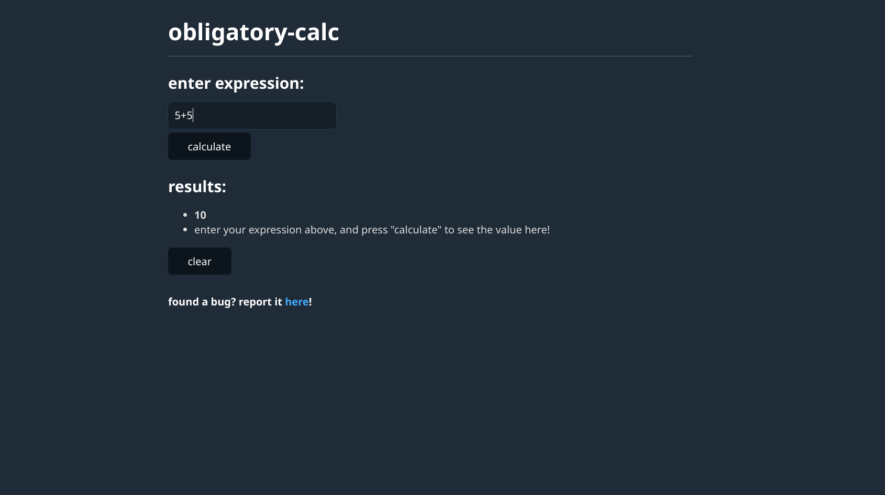

# Writeup

Obligatory Calc was the last web challenge, and the hardest one by far. Just like Safelist, the code was fairly small (at least, much smaller than the Rust challenge). The site implements a calculator using `mathjs`, where we can find the results of arbitrary math expressions.



We type out an expression in the top box, then hit "calculate" to see the result. It also saves our calculator history in the results section. This is a client-side XSS challenge, so there's a section to report a link to the admin bot.

This code was inspired by terjanq's challenge so-xss, which I highly recommend you check out!

First, let's take a look at the CSP: `default-src 'self'; object-src 'none'; base-uri 'none'; script-src * 'unsafe-inline';`

Surprisingly, `'unsafe-inline'` is present in the `script-src` directive! This means that if we can inject arbitrary HTML tags somewhere, we instantly get JS execution. But sadly, the challenge isn't that simple...

The only place we can inject HTML is here in the client-side:

```javascript
            window.results.replaceChildren(
              ...results.map(h => Object.assign(document.createElement('li'), { innerHTML: h }))
            );
```

If we can somehow sneak some HTML into the `results` array, it will be set as the innerHTML for a new `li` tag. If we had access to setting the user's cookies, this would be easy. Sadly, we can't mess with cookies, so we'll have to find a way to set `results` some other way. Let's take a look at the enclosing function:

```javascript
        window.onmessage = (e) => {
          if (e.source == window.calc.contentWindow && e.data.token == window.token) {
            let results = [ e.data.result, ...[...window.results.children].map(li => li.innerHTML) ];
            window.results.replaceChildren(
              ...results.map(h => Object.assign(document.createElement('li'), { innerHTML: h }))
            );
            document.cookie = "__Host-results=" + encodeURIComponent(JSON.stringify(results)) + "; secure; path=/";
          }
        };
```

Okay so, this site works with `postMessage` communicating between two windows. The main page has an iframe to `/calc`, and when you enter an expression to be calculated, it is sent to the `iframe` running `mathjs` through a postMessage, evaluated, and sent back via another postMessage.

There are then two checks: `e.source == window.calc.contentWindow && e.data.token == window.token` to ensure that the received postMessage message comes from a trusted source. If it passes these checks, we set the innerHTML, and then set our `results` cookie so that we can keep the history on refresh.

From the client-side code, we can basically only run arbitrary mathjs expressions through the `?expr=` URL parameter. How can we use this?

The first idea is, can we get the `/calc` window to send a postMessage back with malicious HTML? Well, the answer is no. We can't get arbitrary JS execution through mathjs, and while we can get arbitrary output from mathjs, it is sanitized before the message is sent.

When we want to evaluate a math expression, this is called:
```javascript
              let result = `${math.evaluate(e.data.expr)}`;
              e.source.postMessage({ token, result: sanitize(result) }, "*");
```

The `sanitize` function looks like this:
```javascript
      const sanitize = (data) => {
        if (window.Sanitizer) { // let's use the new Sanitizer API!
          let li = document.createElement("li");
          li.setHTML(data);
          return li.innerHTML;  
        }
        // fallback to DOMPurify
        return DOMPurify.sanitize(data);
      };
```

So, while our output is being set as innerHTML, it either goes through the new Sanitizer API, or DOMPurify.

I was kind enough to provide a hint that no 0-days were needed, so this should have told the players that there were no vulnerabilities in the Sanitizer API, DOMPurify, or mathjs.

So, getting a message with unsafe contents from `/calc` seems like a no go. Can we somehow bypass the checks?

The first check `e.source == window.calc.contentWindow` checks that the postMessage's source is the `contentWindow` of `window.calc`. `window.calc` is defined on the page load. Here's the entire `window.onload` function:
```javascript
      window.onload = () => {
        window.onmessage = (e) => {
          if (e.source == window.calc.contentWindow && e.data.token == window.token) {
            let results = [ e.data.result, ...[...window.results.children].map(li => li.innerHTML) ];
            window.results.replaceChildren(
              ...results.map(h => Object.assign(document.createElement('li'), { innerHTML: h }))
            );
            document.cookie = "__Host-results=" + encodeURIComponent(JSON.stringify(results)) + "; secure; path=/";
          }
        };

        window.calc = document.getElementById("calc");
        window.results = document.getElementById("results");
        window.calc.contentWindow.postMessage({ token: window.token }, location.origin);

        let params = new URLSearchParams(location.search);
        if (params.has("expr")) {
          send(params.get("expr"));
        }

        document.getElementById("form").addEventListener("submit", (e) => {
          e.preventDefault();
          send(new FormData(e.target).get("expr"));
        });

        document.getElementById("clear").addEventListener("click", () => {
          document.cookie = "__Host-results=[]; secure; path=/";
          location.href = "/";
        });
      };
```

`window.calc = document.getElementById("calc")`, and `#calc` comes from `<iframe src="/calc" id="calc"></iframe>`. So, this basically checks whether the postMessage's source is the iframe. 

To make things even worse, it also checks that `window.token` matches the token provided in the message. `window.token` comes from:

```javascript
const getCookie = (name) => {
  const parts = `; ${document.cookie}`.split(`; ${name}=`);
  return parts.pop().split(';').shift();
};

window.token = getCookie("__Host-token") || [...crypto.getRandomValues(new Uint8Array(32))].map(v=>(v%0xFF).toString(16)).join("");
```

So, the token either comes from the `__Host-token` cookie, or if there is no cookie value for some reason, from some randomly generated value. Then, on page load, this token is sent to `/calc`:
```javascript
window.calc.contentWindow.postMessage({ token: window.token }, location.origin);
```

And then `/calc` will send it back in its result messages. Looking at the code closely, there actually is no way to leak the token directly from a message. The main window only sends the token to pages on `location.origin`, and the `/calc` window will only reply to messages from the same `location.origin`. 

Since we can't spoof the origin of our message, we can't exfiltrate the token.

Well, this seems bad. Both checks seem fairly unpassable, but since we know mathjs is a dead end, we know we have to somehow pass them. Let's start with the first check.

`e.source == window.calc.contentWindow`

If you're paying attention, you might notice that we use the `==` operator instead of `===`. For some reason, we do the comparison using the type coercing equality operator. So, this gives us a hint that we might need to mess with the types of these values.

First, can we mess with `window.calc.contentWindow`? Well, `window.calc` is set with `document.getElementById("calc")`, so what happens if we use mathjs to output the HTML `<div id=calc></div>`? Unfortunately, this classic DOM clobbering vector doesn't work. 

`document.getElementById` takes the first instance of the element in the page, so even if we inject another tag with `id=calc`, it will still target the iframe since that appears before our output. Is there another thing we can do?

Well, since that DOM clobbering vector didn't work, why don't we try clobbering `document.getElementById` instead? This is the 3rd time I've used this technique in a challenge 🙃

Surprisingly, unlike DOMPurify, the Sanitizer API allows you to clobber things in the `document`, so we can actually clobber `document.getElementById` with ``. Reading the Sanitizer API spec [here](https://wicg.github.io/sanitizer-api/#dom-clobbering), we see that the Sanitizer API is not configured to protect against DOM clobbering attacks in its default state, which is perfect for us.

Okay, so if we clobber with ``, we now get an error when the page loads, stopping it from setting `window.calc`. But since the iframe with that id still exists on the page, `window.calc` still references our iframe. But now, we can combine this with the clobbering from before! If we inject `<div id=calc></div>`, `window.calc` will point to an HTML collection of our iframe and div, and `window.calc.contentWindow` will be undefined.

Okay, so we can change `window.calc.contentWindow` now. Can we change `e.source` to be undefined as well? Well, no. `e.source` is always set to the source of the postMessage, and the postMessage has to come from somewhere, so `e.source` can't be undefined. Can we change `window.calc.contentWindow` to a window element somehow? Well, no, since we can't inject another iframe onto the page because the Sanitizer API blocks it.

Do you remember that we're using the type coercing equality operator? Well, unlike the identity operator (`===`), `null == undefined` is true! And in Chrome, you actually can get `e.source` to be `null`!

If you send a message from a window, and immediately close it, `e.source` will become `null` since the window which once existed no longer does. It looks a little bit like this:

```javascript
let iframe = document.createElement('iframe');
document.body.appendChild(iframe);
window.target = window.open("http://localhost:8080/");
await new Promise(r => setTimeout(r, 2000)); // wait for page to load
iframe.contentWindow.eval(`window.parent.target.postMessage("A", "*")`);
document.body.removeChild(iframe);
```

We first create an iframe, and once the page loads, we send a message from the iframe and then immediately remove it. If you check the received message, you'll notice that `e.source` is null. Perfect!

So, with this, the comparison `e.source == window.calc.contentWindow` does `null == undefined`, which is true, passing the first check.

`e.data.token == window.token`

This was the second and harder check. `e.data.token` comes from our messagae, and `window.token` is created when the page loads. Let's see how it works again:

```javascript
const getCookie = (name) => {
  const parts = `; ${document.cookie}`.split(`; ${name}=`);
  return parts.pop().split(';').shift();
};

window.token = getCookie("__Host-token") || [...crypto.getRandomValues(new Uint8Array(32))].map(v=>(v%0xFF).toString(16)).join("");
```

So `window.token` either comes from our cookie, or from randomly generated values. Well, can we mess with the `getCookie` function? Yes! I've used this exact same `getCookie` function before, and it is interesting since it is vulnerable to more DOM clobbering.

If we load the HTML ``, `document.cookie` gets clobbered to an HTML tag, which will make `getCookie("__Host-token")` return `null`. Hm, but if it returns `null`, it will fallback to the randomly generated values, which we can't predict either...

So, there are two options for us:

1. we either need to somehow leak the token
2. we need to somehow force the token to be a specific value

We know that option 1 is basically a no-go. We can't intercept the token in any of the messages sent, and we can't read any variables in the client-side.

So, we have to go with option 2. If we go to the fallback function, we lose since we definitely can't predict `crypto.getRandomValues`.

This leaves us with another two choices:

1. Somehow get `getCookie` to return a value we know that is defined
2. Somehow get `getCookie` to error

The second choice is actually very interesting. If we somehow cause an error in `getCookie`, the `window.token` assignment will fail, and it will be `undefined`. We can't do option 1 since we can't control the exact value of `document.cookie` (at least, not with what we're given), so we have to find some way to get `getCookie` to error.

We actually can do this! If we inject the HTML `<form name=cookie><input id=toString></form>`, `document.cookie` will point to the outer form, `document.cookie.toString` will point to the inner input tag, and so then, the call `document.cookie.toString()` will fail, since that won't be a function.

There's only one problem: this doesn't work. Remember, we are getting our HTML injections from the message handler, which first sets the HTML, and then the cookie. We need these injections to be present on page load, so they have to be set in the cookie. Let's look at that code again:

```javascript
            window.results.replaceChildren(
              ...results.map(h => Object.assign(document.createElement('li'), { innerHTML: h }))
            );
            document.cookie = "__Host-results=" + encodeURIComponent(JSON.stringify(results)) + "; secure; path=/";
```

So, we first set the HTML on the page, and then set the cookie. There's a major problem here. The first line sets the HTML, and replaces `document.cookie` with our form. Then, the second line assigns to `document.cookie`. But this doesn't work anymore, since `document.cookie` no longer points to the actual browser cookie, but our HTML element!

If we use any sort of vector to DOM clobber `document.cookie`, it can't be saved to our cookie after. Since we need our vector to be on the page as it loads (since `window.token` loads immediately), DOM clobbering `document.cookie` is actually a dead-end.

Okay, so what do we do then? Well, do you remember what I said at the top of the writeup? This challenge was inspired by `so-xss`...

In `so-xss`, the solution was to open a window reference from a sandboxed null origin iframe. This makes it so the opened window also has a null origin, which you could do bypass some checks. 

Something cool about null origin pages, any accesses to `document.cookie` actually fail! You get this error:
> Uncaught DOMException: Failed to read the 'cookie' property from 'Document': The document is sandboxed and lacks the 'allow-same-origin' flag.

Which totally makes sense. So now, if you open the target page with a `null` origin, `document.cookie` will error on being read, which will make `window.token` undefined. So now, we don't even have to send a token as part of our payload.

This bypasses the second check, allowing us to get any HTML we want, including unsafe tags, onto the page to get JS execution. And even though we have a null origin, our cookies were still sent along, so our flag will be in the page source for us to read.

Now, the only problem is chaining these two checks together, and this actually caused me quite a bit of trouble. But, by messing with things, this should be doable. I actually ended up doing some really contrived method that used iframe timings and `onload`.

You can see my solution in this repository folder, and you can see terjanq's (the only solver) solution [here](https://gist.github.com/terjanq/0bc49a8ef52b0e896fca1ceb6ca6b00e).

> **SEKAI{i_shou1d_h4ve_stuck_to_my_ti84_in5tead}**