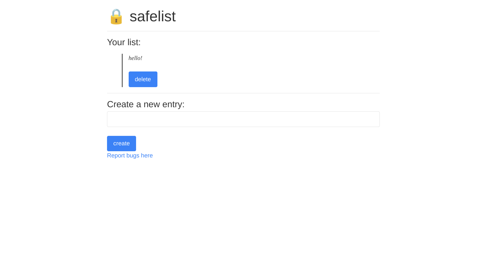

# Writeup

In Safelist, you have a simple app where you can just add notes to a list.



You can put any text and create a new entry in the list, which will be saved to the server which you can view later. The client receives the list from the server, runs DOMPurify on each post, then adds it to `innerHTML`. So, we have HTML injection, but no JS execution. 

This is a client-side challenge, and the admin bot has the flag in one of the list entries. Our goal is to somehow retrieve the flag from the site.

Checking the server-side code, we see this code in the middleware:
```javascript
    res.locals.nonce = crypto.randomBytes(32).toString("hex");

    // Surely this will be enough to protect my website
    // Clueless
    res.setHeader("Content-Security-Policy", `
        default-src 'self';
        script-src 'nonce-${res.locals.nonce}' 'unsafe-inline';
        object-src 'none';
        base-uri 'none';
        frame-ancestors 'none';
    `.trim().replace(/\s+/g, " "));
    res.setHeader("Cache-Control", "no-store");
    res.setHeader("X-Frame-Options", "DENY");
    res.setHeader("X-Content-Type-Options", "nosniff");
    res.setHeader("Referrer-Policy", "no-referrer");
    res.setHeader("Cross-Origin-Embedder-Policy", "require-corp");
    res.setHeader("Cross-Origin-Opener-Policy", "same-origin");
    res.setHeader("Cross-Origin-Resource-Policy", "same-origin");
    res.setHeader("Document-Policy", "force-load-at-top");
```

That's a lot of security headers. The important one here is the CSP, where basically we can't use anything that's not already located on the site. Let's look at the other routes:

```javascript
app.post("/create", (req, res) => {
    let { text } = req.body;

    if (!text || typeof text !== "string") {
        return res.end("Missing 'text' variable")
    }

    req.user.list.push(text.slice(0, 2048));
    req.user.list.sort();

    res.redirect("/");
});

app.post("/remove", (req, res) => {
    let { index } = req.body;

    if (!index || typeof index !== "string") {
        return res.end("Missing 'index' variable");
    }
    
    index = parseInt(index);
    if (isNaN(index)) {
        return res.end("Missing 'index' variable");
    }

    req.user.list.splice(index, 1);
    res.redirect("/");
});

app.get("/", (req, res) => {
    res.render("home", { list: encodeURIComponent(JSON.stringify(req.user.list)) });
});
```

There's a `/create` endpoint, which takes our message, limits it to 2048 chars, then adds it to our list and sorts. Then there's also the `/remove` endpoint, letting us remove an entry from our list entirely, shifting the rest of the elements over.

That's basically the entire app, much less code than the previous challenge. So, how can we get the flag?

This is a classic XS-Leaks style challenge. If you don't know what XS-Leaks are, I highly recommend that you read the wiki [here](https://xsleaks.dev/). But essentially, we need to abuse some sort of browser side-channel to read the flag.

Usually, XS-Leak attacks can leak one bit of information at a time through some sort of oracle. So, we need to find an oracle in the challenge. Typically, these sorts of challenges will have some sort of "search" functionality, and then we can try and somehow detect the difference from a positive and negative search.

But, there's no search functionality. Obviously, we want to somehow use our HTML injection in some way. The site has no CSRF protection, so we can arbitrary create and remove entries, but not read any responses from the server. We want to somehow create a method where if a condition is true, our HTML tags are still on the page, else, our HTML tags aren't on the page.

We can do this by abusing the sort! Imagine two scenarios:

1. Our entry is alphabetically before the flag entry
    * Then the list look something like this: ["OUR ENTRY", "FLAG"]
    * By deleting the first entry (index 0), we will be left with: ["FLAG"]
2. Our entry is alphabetically after the flag entry
    * Then the list look something like this: ["FLAG", "OUR ENTRY"]
    * By deleting the first entry (index 0), we will be left with: ["OUR ENTRY"]

This works perfect! By abusing the sort and deleting a constant index, we have two different scenarios that we can potentially leak. Now, how do we leak whether our entry is on the page?

Obviously, we need to do something special with the HTML tags. There is no way to leak something like an HTTP request past the CSP with DOMPurify, so what do we do?

Well, this was the heart of the challenge, finding some sort of vector to leak whether our tags were present. All solvers (and me), did this differently. You can find some other solutions here:

* terjanq: https://twitter.com/terjanq/status/1576605101514313735
* huli: https://twitter.com/aszx87410/status/1576861710606307329

I'll describe my solution: a modification of the connection pool leak. One attack on the XS-Leaks wiki is the [connection pool leak](https://xsleaks.dev/docs/attacks/timing-attacks/connection-pool/), which I recommend that you read before we continue.

But basically, there is a global pool of sockets used to communicate with servers, and once they're all used up, we have to wait for one to free before another request can be made.

Normally, you aren't supposed to be able to read the network timing of a request, especially a request with cookies. But, the connection pool leak lets us do just that. We first block all sockets except for one, then we:

1. start a timer
2. make a request to the target site with cookies (that we shouldn't be able to time)
3. make a request where we can run code once it finishes

The second request that we can time can only start once the request to the target site finishes. So, we wait for the second request to finish, then we check the change in time since the timer started. This change in time will contain the network timing for the request to the target site!

This leak is useful if the oracle we want to leak changes the load speed from the server, for example, if it takes a lot longer to load the page if we are logged in, we can detect that difference with this leak.

But, this leak in its current state doesn't actually help us with our oracle. We can only leak the network timing for one request, the request to the target site, but that doesn't change even if our HTML is present or not.

This is where my simple modification to this leak comes in: instead of making one request in step 3, we make multiple. Then, with our HTML injection, we load many `` tags that make requests to some place on the website, like `/js/purify.js`.

What does this do? Well, the target site is going to make many requests when it loads, and our leak script will also make many requests (that we can time). There is only one socket remaining, so what will happen? Well, both sites will fight over the remaining socket.

If our HTML is not present, the time our leak script will measure will be the time it takes for the target page to load, as well as all the times for the requests it makes to finish.

If our HTML is present, the time our leak script will measure will be the time it takes for the target page to load, the time for however many `` tags to load, as well as the times for all the requests it makes to finish.

There is an obvious and detectable difference here! This attack essentially measures the "network congestion" of the global socket pool. If a background site is making many requests, the sockets in the global socket pool will be in contention with the requests from our leak scripts.

Using this modified XS-Leak, we can detect whether our HTML is on the page, and by extension, whether a certain character is alphabetically before or after the flag. This is all we need to leak the flag, character by character.

> **SEKAI{xsleakyay}**

The solve script is in this repository folder.